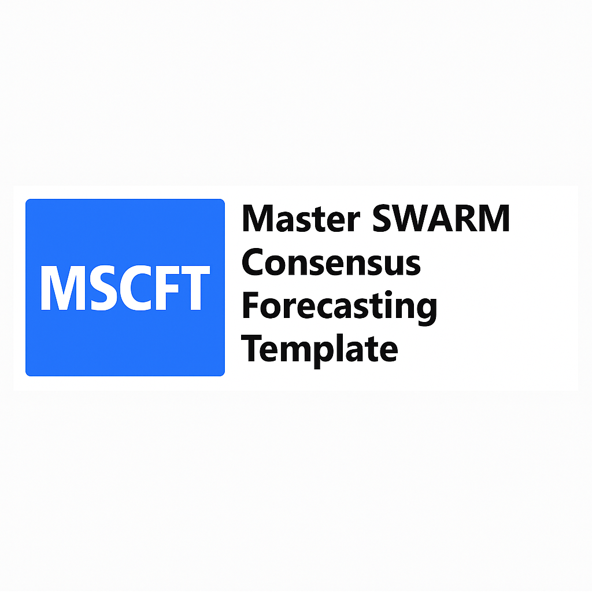

<link rel="icon" href="/MSCFT-/favicon.ico" type="image/x-icon">

 

# Master SWARM Consensus Forecasting Template (MSCFT)

Welcome to the official forecasting repository for the **Master SWARM Consensus Forecasting Template (MSCFT)** — a structured, auditable framework designed to support accurate, high-quality judgment-based forecasts across domains such as innovation, public policy, and geopolitics.

---

## 🔗 Quick Links

- 📊 [Forecast Index](./forecast-index.md)
- 🧠 [FML Tag Reference Guide](./docs/Markup.md)
- 📂 [Templates Folder](./templates)
- 📁 [Example Forecasts](./examples)
- 📝 [Forecast Audit Logs](./logs)

---

## ✍️ About MSCFT

MSCFT (currently v3.1B) combines inside-outside view reasoning, LLM collaboration, and transparent probability logging in a 7-section template:

1. Forecast Title  
2. Initial Question Framing  
3. Refinement & Analysis  
4. Data Anomaly & Source Integrity Log  
5. Probability Allocation  
6. Final Forecast Summary  
7. Why Might This Forecast Be Wrong?

The MSCFT is used in challenges like the Good Judgment Open (GJO) Vehicle Innovation series, RANGE forecasting trials, and independent crowd-based analytics.

---

## 👤 Maintainer
**Brian Helip** — Forecast developer, analyst, and longtime contributor to GJO, HRL Labs, and RANGE platforms.

For feedback or contributions, see [CONTRIBUTING.md](./CONTRIBUTING.md)

---

_This site is powered by GitHub Pages and maintained by the forecasting community._
